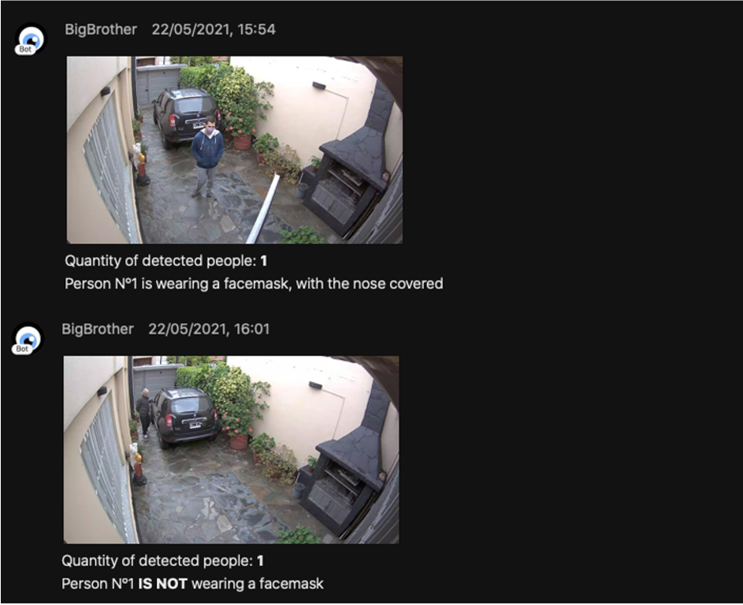

# Meraki Facemask Detector

## Description

This project integrates Meraki MV Cameras with Amazon Rekognition through their APIs to perform a deeper image analysis, to detect whether a person is wearing a facemask or not. The results will be posted into a Webex Teams space.

### Workflow

The workflow will be the following:


## Before start: What do you need

1. Access to a Meraki Dashboard (and its API key) with an **MV Camera** and **MV Sense license** available.

2. An **AWS Account**, with an *access* and *secret* key created ([Instructions on how to generate them](https://docs.aws.amazon.com/powershell/latest/userguide/pstools-appendix-sign-up.html))

3. A **Webex** account. You will need it to create a Bot and grab its Access Token. You'll find instructions on how to do it [here](https://developer.webex.com/docs/bots#creating-a-webex-bot).

4. An **MQTT broker** reachable by the MV Camera. It can be configured on your laptop, or a separate server. In my case, I used a Raspberry Pi 3b+ with a Debian image, and I installed [Mosquitto](http://mosquitto.org/), an open source MQTT Broker.

## Usage

1. Clone this repo in your local machine typing on your terminal:

```https://github.com/agmanuelian/Meraki_Facemask_Detector.git```

2. Install the required dependencies specified on the _requirements.txt_ file:

```pip install requirements.txt```

3. Set up your MQTT Broker, and configure it on the Meraki Dashboard
    1. Select your MV Camera
    2. Go to Settings
    3. Select Sense
    4. Enable your MV Sense license
    5. Select *Add or edit MQTT Brokers* and configure its parameters.
    6. After you added your broker, select it on the dropdown list.
    7. Save your changes. 

4. Configure your credentials on the *lambda_module/main.py* file.

5. On you AWS account, set up your **Lambda Function**. When it's time to upload your code, zip the *lambda_module* directory, and upload the .zip file. 

#### Lambda Setup - Step 1


#### Lambda Setup - Step 2


6. On you AWS account, set up your **API Gateway**. Once deployed, grab its public address. You will need it on the next step.

#### API Gateway Setup - Step 1


#### API Gatewat Setup - Step 2


7. Replace your credentials on the *mqtt_trigger.py* file. The API URL that you got on the previous step, should be added to the script on this step.

8. Add your recently created bot to a Webex room. The bot access token and the Room ID should be already configured on the *lambda_module/main.py* file.

9. Run the *mqtt_trigger.py* script. You should see displayed on the terminal a real time feed of the detected people quantity. When a person gets in front of the camera, it will trigger the API call and process the function. The results will be posted on the Webex room.

## Output

This are the results of the image analysis posted into a Webex Room.



