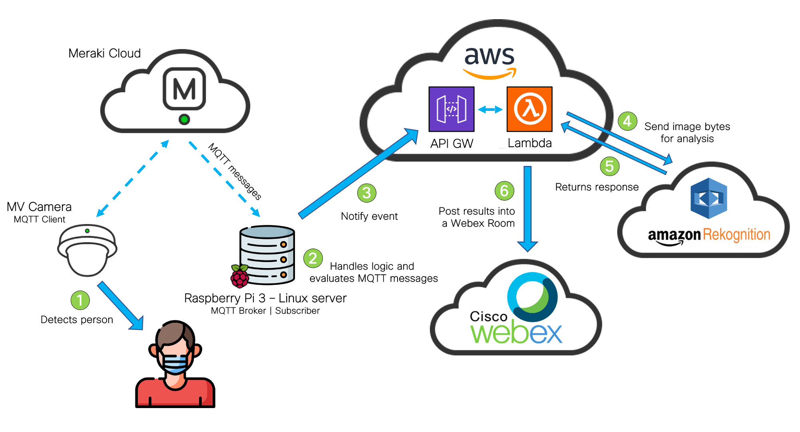

# Meraki Facemask Detector

## Description

This project integrates Meraki MV Cameras through their APIs to perform a deeper analysis through Amazon Rekognition, to detect when a person is wearing a facemask or not. The results will be posted on a Webex Teams space.

### Workflow

The workflow will be the following:



## Before start: What do you need

1. Access to a Meraki Dashboard (and its API key) with an **MV Camera** and **MV Sense license** available.
2. An **AWS Account**, with an *access* and *secret* key created ([Instructions on how to generate them](https://docs.aws.amazon.com/powershell/latest/userguide/pstools-appendix-sign-up.html))
3. A **Webex** account. You will need it to create a Bot and grab its Access Token. You'll find instructions on how to do it [here](https://developer.webex.com/docs/bots#creating-a-webex-bot).
4. An **MQTT broker** reachable by the MV Camera. It can be configured on your laptop, or a separate server. In my case, I used a Raspberry Pi 3b+ with a Debian image, and I installed [Mosquitto](http://mosquitto.org/), an open source MQTT Broker.

## Usage

1. Clone this repo in your local machine typing on your terminal:

```https://github.com/agmanuelian/Meraki_Facemask_Detector.git```

2. Install the required dependencies specified on the _requirements.txt_ file:

```pip install requirements.txt```

3. Set up your MQTT Broker, and configure it on the Meraki Dashboard
  a. Select your MV Camera
  b. Go to Settings
  c. Select Sense 
  d. Enable your MV Sense license
  e. Select *Add or edit MQTT Brokers* and configure its parameters.
  f. After you added your broker, select it on the dropdown list.
  g. Save your changes. 

4. Configure your credentials on the *lamda_module/main.py* file.

